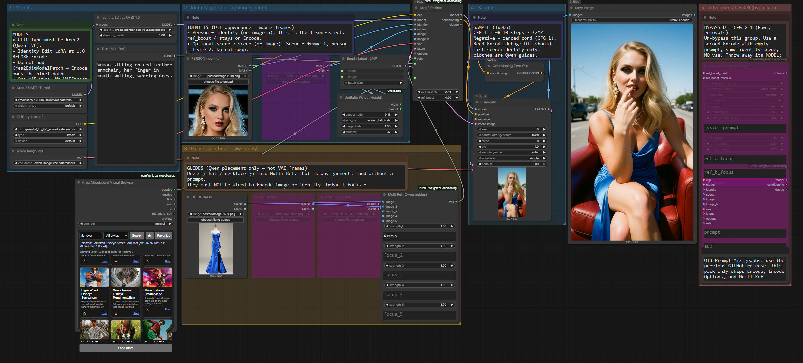

# Krea2 Split Encode

One encode for Krea 2. The person is a VAE frame. Scene and clothing are Qwen placement, not extra appearance frames.



Stock `(word:1.4)` does nothing here. Krea 2 reads prompts through Qwen3-VL. This pack scales only the aux tokens inside one chat sequence, and runs the Identity Edit pixel path when a VAE is connected. No per-image `VAEEncode`. No Mustyrocks `Krea2EditModelPatch`.

| | |
|---|---|
| **Nodes** | Krea2 Split Encode · Split Encode Options · Split Ref |
| **Category** | `Krea2/conditioning` |
| **Outputs** | `MODEL`, `CONDITIONING`, `debug` |
| **Example** | [`workflows/krea2_encode_identity.json`](workflows/krea2_encode_identity.json) |
| **Repo** | [cicalooo/ComfyUI-Krea2-WeightedConditioning](https://github.com/cicalooo/ComfyUI-Krea2-WeightedConditioning) |

Prompt Mix is gone. Old graphs stay on the previous GitHub release. Rebuild with `prompt` / `aux`.

```bash
cd ComfyUI/custom_nodes
git clone https://github.com/cicalooo/ComfyUI-Krea2-WeightedConditioning.git
```

Restart ComfyUI. Native Krea 2 only. No extra pip packages.

Optional moodboards: [Andro-Meta/ComfyUI-Krea-Moodboards](https://github.com/Andro-Meta/ComfyUI-Krea-Moodboards). Wire **Visual Browser `positive`** into Encode **`aux`**.

## Wire

Load the Identity Edit LoRA **before** this node. Wire **MODEL** and **CONDITIONING** to the sampler.

```
person ── identity (or image_b)
scene  ── scene (or image)     optional
clothes ── Split Ref ── refs   optional, Qwen only
VAE ── vae
empty latent ─┬─ latent
              └─ KSampler.latent_image
```

| Connected | What runs |
|---|---|
| Nothing | Text mix. Prompt at 1.0, aux scaled. |
| Images, no VAE | Qwen grounding only. |
| Person + VAE, no guides | Trained edit. Scene is frame 1, person is frame 2, `ref_boost` ~4 on the person. |
| Person + VAE + Split Ref | Person is the **only** VAE frame. Scene and clothes are Qwen. A scene VAE frame fitted to the output overwrites the face. |

`image` / `image_b` are aliases for scene / identity. Named sockets win.

Split Ref strength **~0.45**. At 1.0 a clothing photo competes with the face. Empty aux, or `aux_strength` **0**, if you want stock Krea Edit behavior. A long moodboard outweighs a short prompt even at 0.45.

Debug you want with clothes connected: `DiT refs=1 (identity) boosts=[4.0]` and `scene is Qwen-only while guides are connected`.

## Sampler

| Job | Setup |
|---|---|
| Text mix, most edits | Turbo, CFG **1**, ~8–12 steps |
| Removals | Raw, CFG **~3**, ~20 steps |

Stay **≤2MP**. At CFG > 1, negative is a second Encode with an empty prompt, the same images, and **no VAE**. Discard that node's MODEL.

## Nodes

**Split Encode** — `prompt`, `aux`, `aux_strength` (0 omits, under 1 weakens, over 1 enforces, default 0.45). `ref_boost` default 4, person only.

**Split Encode Options** — one wire. People lock off, emphasis, masks, scene boost, grounding. Disconnected means defaults.

**Split Ref** — up to 5 clothing/object guides. Not VAE frames. If no person is wired, slot 1 becomes identity.

Longer notes: [docs/reference.md](docs/reference.md).

## Additional credit

Mustyrocks **Krea2Edit** and **Birds Weighted Conditioning** (per-ref focus, vision strengths, and the in-node edit wrap) both pass through this pack. This node is a split of those paths, not a replacement of their work.

Moodboard aux text is optional and lives in a separate pack: [ComfyUI-Krea-Moodboards](https://github.com/Andro-Meta/ComfyUI-Krea-Moodboards) (Andro-Meta). Not bundled here.

## License

Apache-2.0. See [LICENSE](LICENSE). Identity Edit pixel path is vendored from [comfyui-krea2edit](https://github.com/lbouaraba/comfyui-krea2edit). Attention weighting follows [KJNodes](https://github.com/kijai/ComfyUI-KJNodes) `Krea2 Prompt Weight`. Do not stack a second attention-weight patch on the same blocks.
