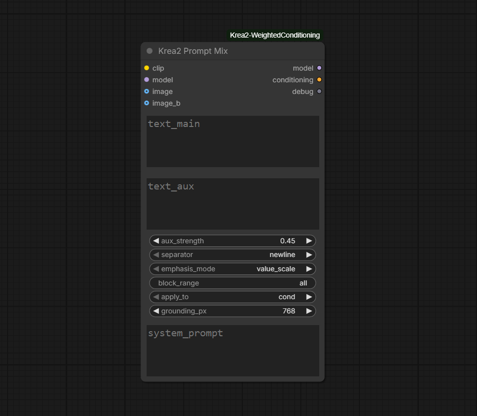

# ComfyUI Krea 2 Weighted Conditioning

**Krea2 Prompt Mix** — keep a subject / edit instruction at strength **1.0**, and scale a second moodboard / style prompt through Krea 2 **self-attention**.

Stock `(word:1.4)` is CLIP-era syntax. Krea 2 reads prompts through **Qwen3-VL**, which ignores it. This node encodes **one** Qwen sequence and weakens only the auxiliary tokens — so the moodboard does not steal the subject.

Optional **Mustyrocks K2 Edit** image grounding (same Qwen3-VL prep as Grounded Encode). Leave image inputs disconnected for plain text mix.

| | |
|---|---|
| **Node** | Krea2 Prompt Mix |
| **Category** | `Krea2/conditioning` |
| **Outputs** | `MODEL`, `CONDITIONING`, `debug` |
| **Deps** | Native ComfyUI Krea 2; no extra pip packages |

---

## Install

```bash
cd ComfyUI/custom_nodes
git clone https://github.com/cicalooo/ComfyUI-Krea2-WeightedConditioning.git
```

Restart ComfyUI.

---

## Why Prompt Mix?

Concatenating two K2 encodes (or wrapping the board in `(prompt:0.5)`) often lets the moodboard dominate. Prompt Mix builds a single sequence:

```
[ handwritten / edit instruction ]  [ moodboard / style ]
         strength 1.0                    aux_strength (default 0.45)
```

- **Do not** `ConditioningConcat` two K2 encodes — each already carries the chat template.
- Wire **both** `MODEL` and `CONDITIONING` into the sampler.
- Load LoRAs **before** this node so the attention patch is applied last.
- Incompatible with **Krea2 Apply Regional** joint masks.



### Text-only wiring

```
STRING (subject) ──────── text_main ─┐
Moodboard.positive ────── text_aux ──┤ Prompt Mix ─┬─ MODEL ──────── sampler
CLIP (type krea2) ─────── clip ──────┤             └─ CONDITIONING ─ sampler.positive
UNET ──────────────────── model ─────┘
```

`image`, `image_b`, `grounding_px`, and `system_prompt` are **ignored** when no image is connected.

### Parameters

| Parameter | Notes |
|---|---|
| `aux_strength` | **0.35–0.55** typical weaken · `1.0` equal · `0.0` omits aux and encodes main only (no model patch) |
| `emphasis_mode` | `value_scale` (default) · `k_bias` · `both` |
| `apply_to` | `cond` (CFG 1 has no uncond pass) |
| `block_range` | `all` (default), `0-27`, or `4,8,12` if the effect is too strong |
| `separator` | How main and aux are joined before tokenization |
| `debug` | Reports how many aux tokens were scaled; ~0 means the join failed to split |

`value_scale` leaves K2Edit `ref_boost` masks alone. `k_bias` / `both` **add** key bias on top of that mask.

### Sampler CFG

| Mode | CFG |
|---|---|
| Text-only mix | **1.0** |
| Mustyrocks K2 Edit (Turbo) | **1** |
| Mustyrocks Raw (e.g. delete salient content) | ~**3**, ~20 steps (per Mustyrocks) |

Keep an empty negative if your K2 graph goes grainy without one. For text-only CFG 1, `ConditioningZeroOut` on the mixed cond is fine.

**Conditioning Krea 2 Rebalance** can sit on the CONDITIONING output (tap EQ). Orthogonal to this node.

---

## Mustyrocks K2 Edit (optional)

When running Identity Edit, wire Prompt Mix like Mustyrocks **Grounded Encode**: same CLIP, same source `image` (and `image_b` for two-ref), edit instruction on `text_main`. Prompt Mix grounds internally, then mixes `text_aux`.

- Leave Mustyrocks **positive** Grounded Encode off the graph.
- Keep **`Krea2EditModelPatch`** for source latents — Prompt Mix does not inject latents.
- For **CFG > 1**, negative = empty instruction grounded with the **same image(s)** via Mustyrocks Grounded Encode (trained unconditional).

One grounded sequence:

```
[vision tokens] [main edit instruction @ 1.0] [aux / moodboard @ aux_strength]
```

Aux weights are applied **after** Qwen expands `<|image_pad|>` into vision tokens, so vision, main instruction, and chat-template tokens stay at 1.0.

```
Krea2 model
  → Identity Edit LoRA
  → Mustyrocks K2 Edit source patch
  → Prompt Mix (model)
  → KSampler.model

source image(s) + main edit + aux prompt
  → Prompt Mix (conditioning)
  → KSampler.positive
```

| Input | Role |
|---|---|
| `image` | Scene / primary K2Edit source |
| `image_b` | Optional second ref (subject); order is scene then subject |
| `grounding_px` | Cap longest side to Qwen3-VL (default **768**; `0` = native) |
| `system_prompt` | Override grounding system prompt (empty = Mustyrocks training default) |

Empty aux and `aux_strength=0.0` both return grounded main-only conditioning with no model patch. `aux_strength=1.0` returns grounded combined conditioning with no patch.

---

## Tests

From this directory (no GPU required):

```bash
python -m pytest tests -q
```

---

## Credits

Attention-side weighting for Krea 2 follows the approach in [kijai/ComfyUI-KJNodes](https://github.com/kijai/ComfyUI-KJNodes) (`Krea2 Prompt Weight`): V-scale for de-emphasis, k-bias for emphasis.

---

## License

Apache License 2.0. See [`LICENSE`](LICENSE).

---

## Endnote: Prompt Mix vs KJNodes `Krea2 Prompt Weight`

Both nodes use the same **attention-side** idea (scale values / bias keys on token ranges inside K2 self-attention). They solve different jobs.

| | **This pack — Krea2 Prompt Mix** | **KJNodes — Krea2 Prompt Weight** |
|---|---|---|
| **Job** | Two prompts, one encode: subject stays **1.0**, moodboard gets `aux_strength` | Weight **phrases inside one prompt** (attention equivalent of `(phrase:w)`) |
| **How you write it** | Separate `text_main` + `text_aux` fields | One string with weighted spans / syntax KJNodes defines |
| **Encode** | Single Qwen chat sequence — no double template from concat | Weights applied on ranges within that one prompt’s tokens |
| **Best when** | Long moodboard dumps that would otherwise dominate the subject | Emphasize or soften specific words/phrases in a single instruction |
| **K2 Edit** | Optional Mustyrocks-style Qwen3-VL grounding (`image` / `image_b`) built in | Use with your usual encode / grounding graph; not a drop-in Grounded Encode replacement |
| **CFG / wiring** | Text-only mix expects **CFG 1**; wire **MODEL + CONDITIONING** | Follow KJNodes docs; still attention patches on the model path |

**What is better where**

- Prefer **Prompt Mix** when the problem is “handwritten subject + huge style/moodboard dump.” You get a clean main@1.0 / aux@scale split, one encode, and optional K2 Edit grounding without a second Grounded Encode on the positive path.
- Prefer **KJNodes Prompt Weight** when you need fine, in-prompt phrase control — boost or cut individual words without splitting into two fields.
- They are **complementary**, not replacements. Same underlying V-scale / k-bias mechanics; different UX and scope. Do not stack competing attention weight patches on the same blocks without knowing which wins last.
